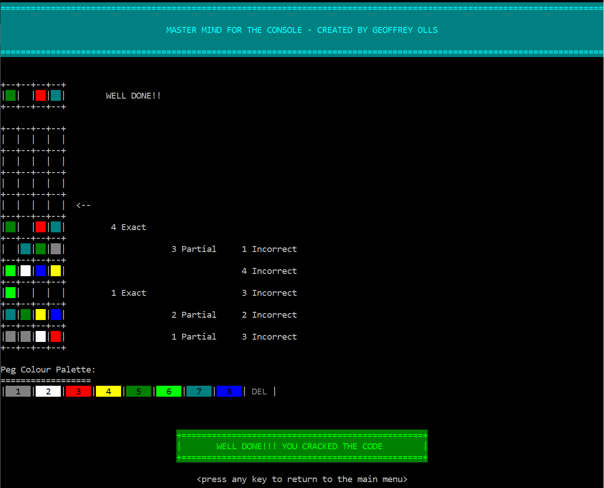
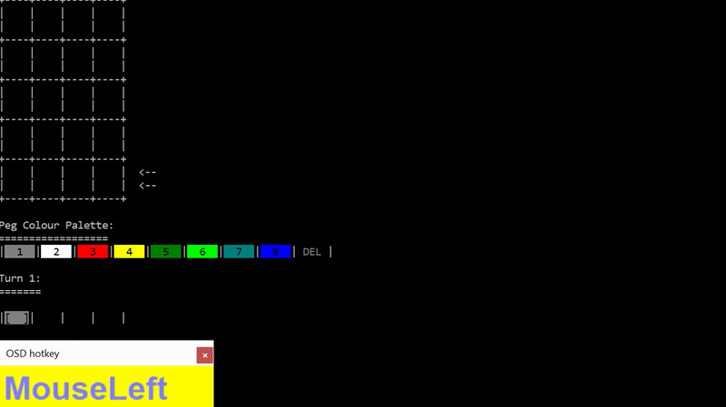
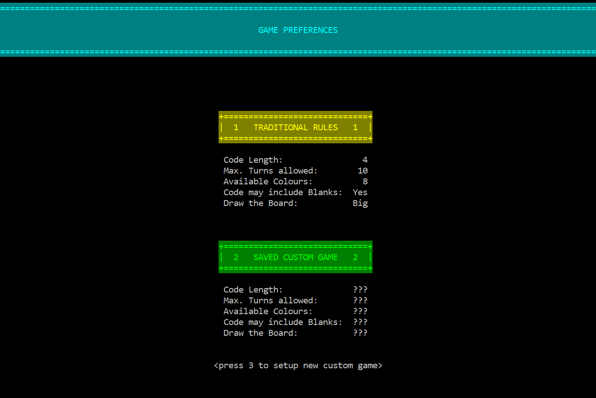
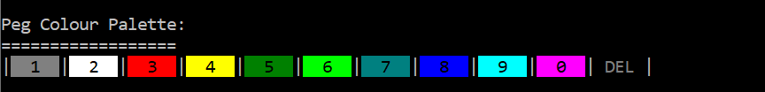

# Master Mind for the Console
 A Console application version of the board game *Mastermind*. It renders a visual depiction of the game board and uses colours, so is not just text-based.
 
 It also supports customizable game parameters for varied experiences.
 
 It is *singleplayer*, in that the computer randomly generates the secret code each game. It can be fun to crack the code as a group though.
 
 I created it during the first year of my degree (2016) -- when our university was shut during protests.
 
 
 
  ## The Code Input System
 
 In December 2020, I overhauled the code input system so that the code does not need to be inputted linearly (typing it from left to right). You can now place and edit pegs in the code in any order. As part of the process, support for blanks (and the option to allow blanks in the secret code) was added too. 
 
 **Note: below is actually a GIF to try show how the input method works [2x speed] (There are some static parts, when some thinking was happening...)**
 
 
 
 In my opinion, this is a more natural approach in that:
 1. **It makes it possible to build your code in descending order of certainty** 
       * *You aren't forced to type in all preceding peg values before being able to record a peg you are more certain is correct and want to work from*
 1. **It is much less (or not) disruptive to update a peg**
       * *You don't have to remember and then delete the part of your code following the peg you want to change, change the peg colour, and then retype the other values again*
 1. **Overall, it helps with jotting down code workings/hypotheses/deductions as they are made to compare them to the information given by the current board state -- making it easier to solve the code.**

 ## The Game Preferences
 The application has five different customizable game settings as can be seen below:
 
 
 
 ### Peg Colours
 The application supports up to 10 colours (or basically 11 -- if blanks are allowed)
 
 
  
 ### Board Size
 The board sizes can be seen at the links below:
 
 * [Tiny Board (screenshot)](docs/size-tiny.PNG)
 
 * [Big Board (screenshot)](docs/size-big.PNG)
 
 * [Huge Board (screenshot)](docs/size-huge.PNG)

 ## The Game Rules
 The scoring and game controls are explained briefly in the link below:
 
 * [How to play (screenshot)](docs/how-to-play.PNG)
